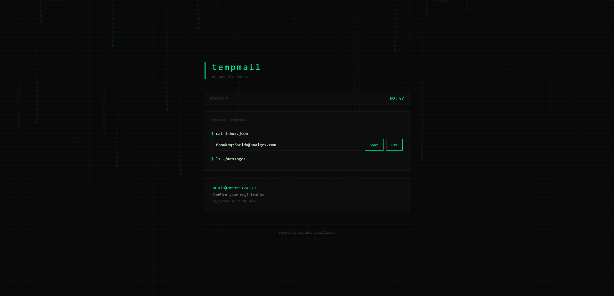
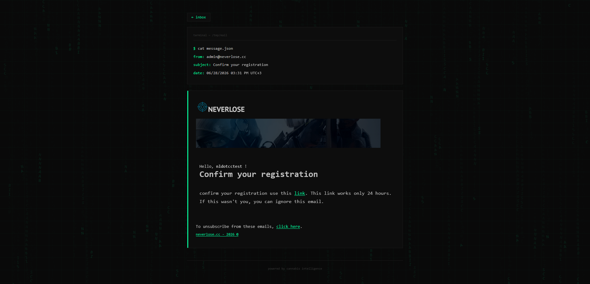
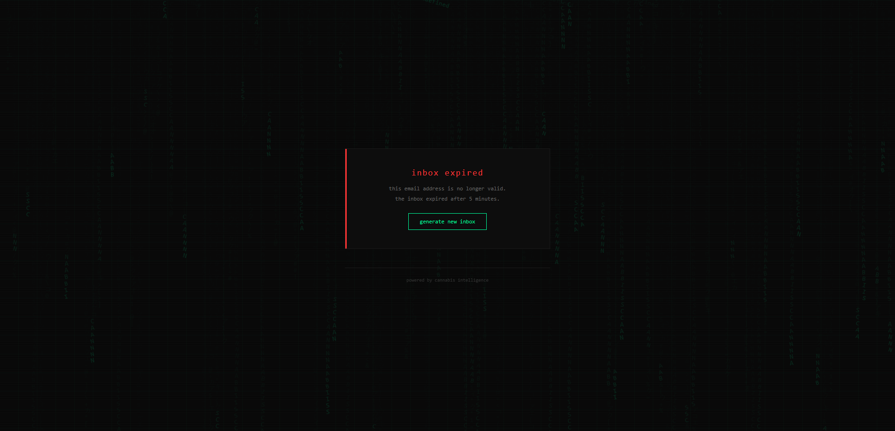

# tempmail

get your API key at [venumzmail.xyz](https://venumzmail.xyz), then replace the values in `main.py`:

```python
API_KEY = "your-key"
DOMAIN = "analgex.com"
```

install dependencies and run:

```bash
pip install requests
python main.py
```

<p align="center">
  
</p>

<p align="center"><i>main page — temporary email with countdown timer and inbox list</i></p>

<p align="center">
  
</p>

<p align="center"><i>email view — original HTML rendered 1:1 in our theme</i></p>

<p align="center">
  
</p>

<p align="center"><i>expired — inbox lifetime ended, generate new address</i></p>
